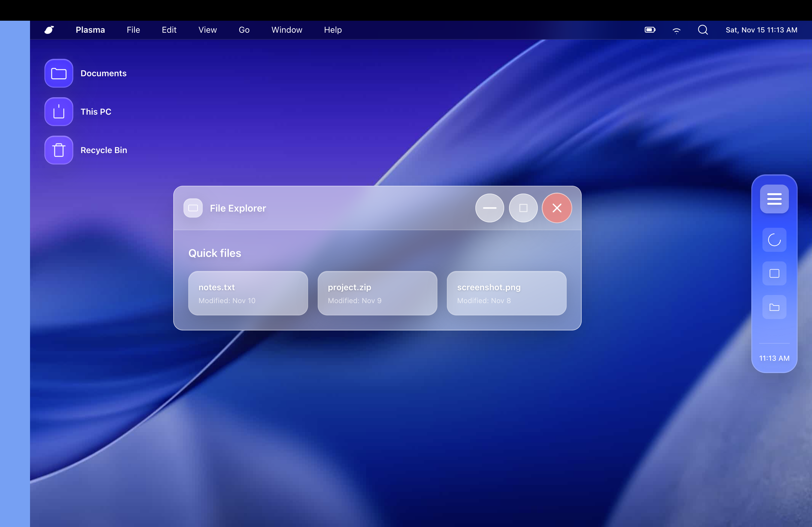

# Liquid Windows

This is a virtual desktop that blends Windows 11 with Liquid Glass design.

## How does it look like?

## How to use

live-server is recommended:
`npm install -g live-server`
To activate:
`live-server`
Then you can open it with localhost.
